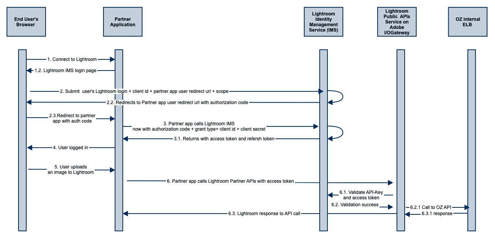

# OAuth integration

The OAuth integration is supported in a consistent way for adobe products. It is provided by the Adobe Identity Management System (IMS). 

### Basic documentation for OAuth

[OAuth (auth code) integration](https://www.adobe.io/authentication/auth-methods.html#!AdobeDocs/adobeio-auth/master/AuthenticationOverview/OAuthIntegration.md)

### API  documentation for Adobe Identity Management System APIS

[Authentication api to get authorization code](https://www.adobe.io/authentication/auth-methods.html#!AdobeDocs/adobeio-auth/master/OAuth/OAuth.md)

Use scope=lr_partner

[Access token and Refresh token](https://www.adobe.io/authentication/auth-methods.html#!AdobeDocs/adobeio-auth/master/Resources/IMS.md) 

Use grant_type=authorization_code or grant_type=refresh_token only depending on what kind of token is needed.

[Exchange refresh token for a new access token](https://www.adobe.io/authentication/auth-methods.html#!AdobeDocs/adobeio-auth/master/Resources/IMS.md)

The refresh token expires every 14 days. Before expiration of refresh token, a new access token and refresh token can be obtained using the existing refresh token. This can be used to make sure that the user does not need to login often.  

[Get new refresh token](https://www.adobe.io/authentication/auth-methods.html#!AdobeDocs/adobeio-auth/master/Resources/IMS.md) 

