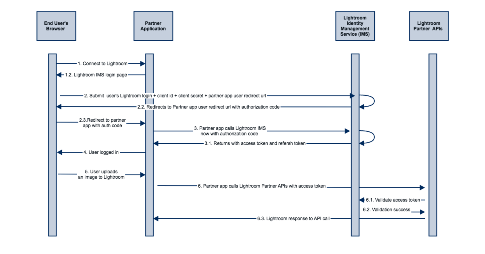
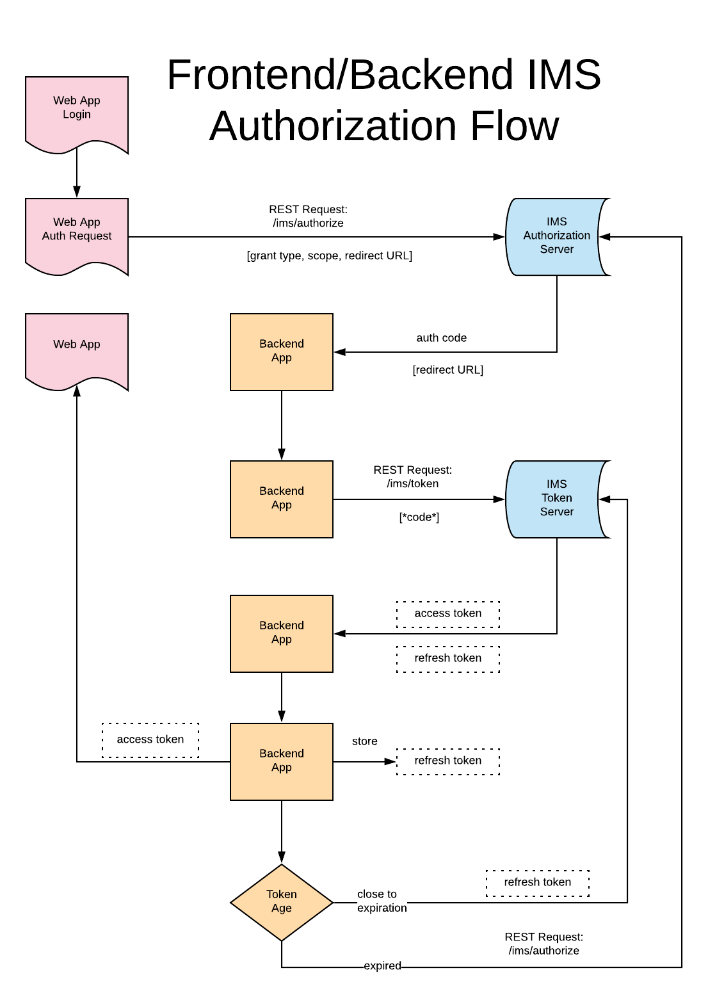

## OAuth Integration

Registered partner applications are entitled to access Lightroom customer content through a user _access token_ generated with a standard OAuth workflow. The OAuth integration is provided by the Adobe Identity Management System (IMS) and is supported across all Adobe services.

### Adobe IMS Authentication

The process of acquiring and refreshing access tokens is described in detail in the [Adobe IMS Authentication and Authorization](https://www.adobe.io/authentication/auth-methods.html#!AdobeDocs/adobeio-auth/master/OAuth/OAuth.md) documentation.

The following must be considered for Lightroom Services integrations:

- Partner integrations must include the `openid,AdobeID,lr_partner_apis` scopes to access Lightroom content.

- Any generated user _access token_ or _refresh token_ **must**  be stored in any backend service in a secured format with encryption at rest.

- The refresh token expires every 14 days. Before expiration of refresh token, a new access token and refresh token can be obtained using the existing refresh token. This can be used to make sure that the user does not need to login frequently.

### Authorization Workflow Diagrams

