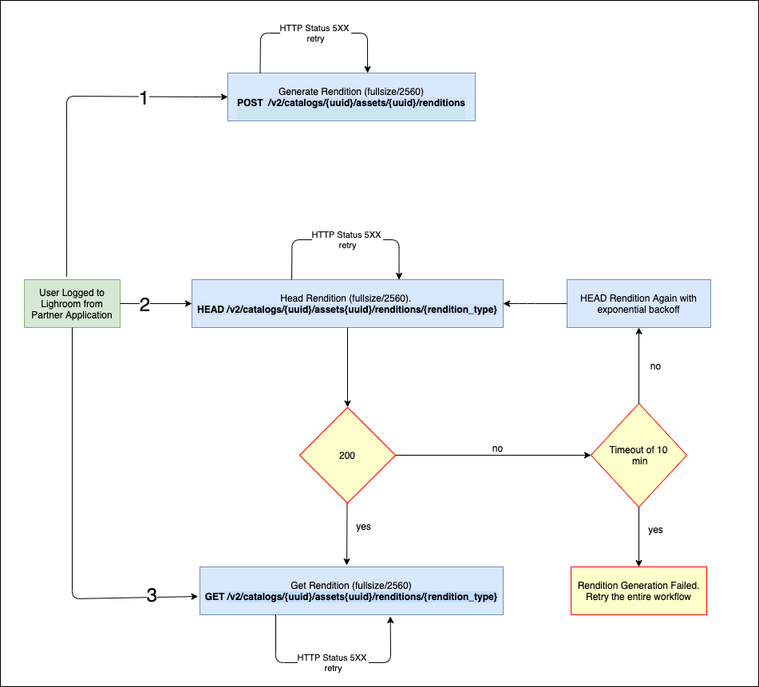

## Read and Generate Renditions

##Renditions
Each photo asset has a set of JPEGs intended for application display of the latest visual representation of the asset (either edited or original uploaded state)

##Details of Renditions

* Creation - Upon uploading a photo, the following resources will be created (JPEG format)
    * thumbnail2x (320 pixels constraint on either edge) 
    * 640 (640 pixels on long edge)
    * 1280 (1280 pixels on long edge) 
    * 2048 (2048 pixels on long edge) 
    
* Edit - Upon editing a photo, the following resources will be newly created with all edits applied
    * thumbnail2x (320 pixels constraint on either edge) 
    * 640 (640 pixels on long edge) 
    * 1280 (1280 pixels on long edge) 
    * 2048 (2048 pixels on long edge) 
    
For best performance, use the smallest size possible for all application scrolling case 


##Workflow to generate renditions for print workflow

Generate renditions for an original file asynchronously. Allowed rendition types are fullsize and 2560. Generated rendition will be deleted after 1 day automatically. Both these renditions must always be requested on demand.  First check to see if one is available, and if not create it. These renditions are not available with basic API access. Should your application require this capability, you must contact Adobe (lightroomcontact@adobe.com) and describe your needs. Here are the details of fullsize and 2560
- Fullsize - size of original with edits, constrained by any applied crops.
- 2560 - 2560 pixels on long edge 


_STEP 1_: Generate Renditions for an asset asynchronously.

```
POST /v2/catalogs/{catalog_id}/assets/{asset_id}/renditions HTTP/1.1
Authorization: {auth_token}
X-Generate-Renditions: {fullsize,2560}
```

Sample success response:

```
HTTP/1.1 202
```

_STEP 2_: Read asset. Check for rendition links (/links/rels/rendition/<rendition_type>) in the asset response. As creation is asynchronous, please poll every 30 seconds until the rendition is available with a timeout of 10 min. If renditions are not genearted within 10 min then probably the operations has failed. You need to retry from Step 1 in that case. Contact us if the problem persists. Read the Usage Guidelines at the end of this page to know the details of the backoff.

```
GET /v2/catalogs/{catalog_id}/assets/{asset_id} HTTP/1.1
Authorization: {auth_token}
```

Sample success response:

```
HTTP/1.1 200
```

_STEP _3: Once the rendition links (/links/rels/rendition/<rendition_type>) are populated in the asset response, then that means that rendition has been generated correctly. Now call the read rendition api to get the rendition. 

```
GET /v2/catalogs/{catalog_id}/assets/{asset_id}/renditions/<rendition_type> HTTP/1.1
Authorization: {auth_token}
```

Sample success response:

```
HTTP/1.1 200
```

NOTE: Refer to the API documentation for further information about above listed APIs.

### Generate Renditions diagrams



