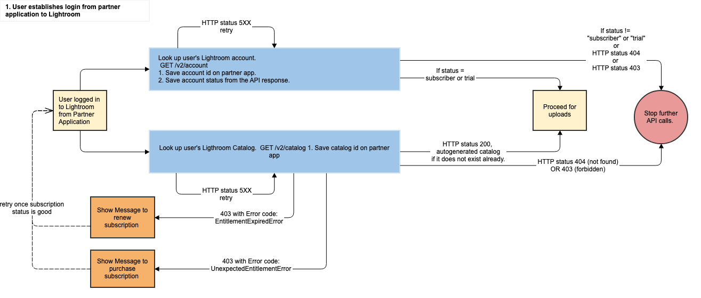

## Upload Customer Images and Videos

The upload workflow should be attempted only for users who already have a Lightroom account with an active subscription and an existing catalog with enough storage space to accommodate the incoming assets. A detailed list of precondition checks is provided later in this document. Use the base endpoint https://lr.adobe.io for all APIs.

### Health Check

At any time, the health of the Lightroom service may be queried with:

`GET /v2/health HTTP/1.1`

Expected success response:

```
HTTP/1.1 200 OK
Content-Type: application/json
Content-Length: {xsd:nonNegativeInteger}
{
    "version": "<product_version>"
}
```

### Check Customer Entitlement

Applications should fetch the customer account information and inspect the `entitlement.status` field to determine the Creative Cloud entitlement of the customer. If this value is not either `subscriber` or `trial`, then any other calls to the Lightroom services will return a `403 Forbidden` error.

```
GET /v2/accounts/00000000000000000000000000000000 HTTP/1.1
Authorization: {auth_token}
Content-Type: application/json
Content-Length: {xsd:nonNegativeInteger}
```

Sample success response:

```
HTTP/1.1 200 OK
Content-Type: application/json
Content-Length: {xsd:nonNegativeInteger}
{
    "base": "<base_url>/",
    "id": "<account_id>",
    "type": "account",
    "links": {
        "self": {
            "href": "/v2/accounts/<account_id>"
        },
        "/rels/apps": {
            "href": "<account_apps_link>"
        },
        "/rels/avatars/small": {
            "href": "/v2/avatars/<account_id>/<timestamp>/small",
            "size": 50
        },
        "/rels/avatars/small2x": {
            "href": "/v2/avatars/<account_id>/<timestamp>/small2x",
            "size": 100
        },
        "/rels/avatars/medium": {
            "href": "/v2/avatars/<account_id>/<timestamp>/medium",
            "size": 115
        },
        "/rels/avatars/medium2x": {
            "href": "/v2/avatars/<account_id>/<timestamp>/medium2x",
            "size": 230
        },
        "/rels/avatars/large": {
            "href": "/v2/avatars/<account_id>/<timestamp>/large",
            "size": 138
        },
        "/rels/avatars/large2x": {
            "href": "/v2/avatars/<account_id>/<timestamp>/large2x",
            "size": 276
        }
    },
    "email": "<email_address>",
    "full_name": "<full_name>",
    "first_name": "<first_name>",
    "last_name": "<last_name>",
    "avatar": {
        "placeholder": {boolean}
    },
    "created": "<created_date>",
    "updated": "<updated_date>",
    "wcd_guid": "<wcd_guid>",
    "country": "<country_id>",
    "entitlement": {
        "status": "<account_status>",
        "trial": {
            "start": "<trial_start_date>",
            "end": "<trial_end_date>"
        },
        "current_subs": {
            "product_id": "<subscription_product_id>",
            "store": "<subscription_store>",
            "purchase_date": "<subscription_purchase_date>",
            "sao": {
                "inpkg_LRMP": "1"
            }
        },
        "storage": {
            "used": <upload_usage_count>,
            "limit": <storage_limit>,
            "display_limit": <storage_display_limit>,
            "warn": <storage_warn_limit>
        },
        "deletion_date": "<deletion_date>"
    },
    "payload": {
        "lightroom": {
            "<settings_key>": "<settings_value>"
        }
    },
    "config": {
        "<config_key>": "<config_value>"
    }
}
```

### Check Customer Catalog

If a Lightroom customer is entitled, an application should fetch the user catalog. Not all entitled customers will have a catalog. They may, for example, actively use other applications besides Lightroom. Only when they have engaged with a Lightroom client application will their catalog be created.

If a user has a catalog, the application should obtain the catalog identifier for use in the upload APIs. Otherwise, an application cannot proceed further.

```
GET /v2/catalogs/00000000000000000000000000000000 HTTP/1.1 
Authorization: {auth_token}
Content-Type: application/json
Content-Length: {xsd:nonNegativeInteger}
```

Sample success response:

```
HTTP/1.1 200 OK
Content-Type: application/json
Content-Length: {xsd:nonNegativeInteger}
{
    "base": "<base_url>",
    "id": "<catalog_id>",
    "type": "catalog",
    "subtype": "<catalog_subtype>",
    "created": "<created_date>",
    "updated": "<updated_date>",
    "links": {
        "self": {
            "href": "catalogs/<catalog_id>"
        },
        "/rels/collections": {
            "href": "catalogs/<catalog_id>/albums?subtype=collection"
        },
        "/rels/images_videos": {
            "href": "catalogs/<catalog_id>/assets?subtype=image%3Bvideo"
        },
        "/rels/deleted_images_videos": {
            "href": "catalogs/<catalog_id>/assets?subtype=deleted_image%3Bdeleted_video&purge_date_after=0000-00-00T00:00:00"
        },
        "/rels/catalog_spaces": {
            "href": "catalogs/<catalog_id>/spaces?subtype=shared"
        },
        "/rels/updates": {
            "href": "catalogs/<catalog_id>/updates"
        },
        "/rels/tasks/index": {
            "href": "<index_task_link>"
        },
        "/rels/tasks/tag": {
            "href": "<tag_task_link>"
        }
    },
    "payload": {
        "name": "<catalog_name>",
        "<key>": "<value>"
    }
}
```

### Upload an Image or Video to the Catalog

At this point, a client application should have a catalog identifier (`catalog_id`), which is necessary for the remainder of the workflow. 

_STEP 1_: Create an asset revision providing newly generated globally unique identifiers (GUIDs) for `asset_id` and `revision_id`. Refer to RFC-4122 for a description of GUIDs. The Lightroom services accept only GUIDs without hyphens. Most languages provide libraries to generate GUID (For examples refer https://docs.oracle.com/javase/7/docs/api/java/util/UUID.html and https://docs.python.org/3/library/uuid.html)

```
PUT /v2/catalogs/{catalog_id}/assets/{asset_id}/revisions/{revision_id} HTTP/1.1 
Authorization: {auth_token}
Content-Type: application/json
Content-Length: {xsd:nonNegativeInteger}
If-None-Match: {xsd:string}
{
	"subtype": "{asset_subtype}",
	"payload": {
		"captureDate": "{image_capture_date}",
		"importSource": {
			"fileName": "{file_name}",
			"contentType": "{content_type}",
			"fileSize": {image_file_size},
			"originalWidth": {image_width},
			"originalHeight": {image_height},
			"sha256": "{image_sha256}",
			"importedOnDevice": "{import_device_name}",
			"importedBy": "{import_account_id}",
			"importTimestamp": "{import_time}"
		},
		"{key}": "{value}",
		"develop": {
			"{dev_key}": "{dev_value}"
		}
	}
}
```

Sample success response:

```
HTTP/1.1 201 
CreatedContent-Length: 0
Location: {xsd:anyURI}
```

_STEP 2_: This is an optional step for image files and not required for video files. If the image to be uploaded requires a sidecar XMP file for the develop settings, use the below API to upload the XMP file before uploading the actual image file. This XMP file can be referred to in the `payload` section while uploading the actual image.

```
PUT /v2/catalogs/{catalog_id}/assets/{asset_id}/revisions/{revision_id}/xmp/develop HTTP/1.1
Authorization: {auth_token}
Content-Length: {xsd:nonNegativeInteger}
Content-Type: application/rdf+xml
X-Generate-Renditions: {xsd:string}
```

Sample success response:

```
HTTP/1.1 201 
CreatedContent-Length: 0
Location: {xsd:anyURI}
```

_STEP 3_: Upload the image or video file binary data. This API allows files up to 200MB to be uploaded. Larger files must be uploaded using this API by including `Content-Range` headers for each part. Clients may make multiple requests with `Content-Range` headers in parallel.

```
PUT /v2/catalogs/{catalog_id}/assets/{asset_id}/revisions/{revision_id}/master HTTP/1.1
Authorization: {auth_token}
Content-Length: {xsd:nonNegativeInteger}
Content-Range: {xsd:string}
Content-Type: {xsd:string}
X-Generate-Renditions: {xsd:string}
X-Generate-Proxies: {xsd:string}
X-Read-Meta: {xsd:string}
```

Sample success response:

```
HTTP/1.1 201 
CreatedContent-Length: 0
Location: {xsd:anyURI}
```

NOTE: Refer API Docs for further information about above listed APIs 

### Precondition checks before attempting upload of image or video

| S.No. | Use Case                                                                                                                                    | Symptoms                                                                                                      | Expected Partner App Behavior                    | 
|-------|---------------------------------------------------------------------------------------------------------------------------------------------|---------------------------------------------------------------------------------------------------------------|--------------------------------------------------| 
| 1     | User doesn't have Lightroom login but has an adobe id. This can happen if the user has login for an adobe product different from Lightroom  | When a call is made to GET /v2/accounts/00000000000000000000000000000000                                      | Do not attempt any other Lightroom Partner APIs. | 
|       | OR                                                                                                                                          | Expect a 200 response but response body element entitlement.status is not "subscriber" or "trial".            |                                                  | 
|       | User has Lightroom login but with no valid subscription.                                                                                    | OR                                                                                                            |                                                  | 
|       | OR                                                                                                                                          | entitlement.storage used >=  limit                                                                            |                                                  | 
|       | User has Lightroom login but usage quota exceeded                                                                                           | OR                                                                                                            |                                                  | 
|       |                                                                                                                                             | calculated the size of images to be uploaded > (entitlement.storage limit - entitlement.storage used)         |                                                  | 
| 2     | User has lightroom account but no lightroom catalog.                                                                                        | When a call is made to GET /v2/accounts/00000000000000000000000000000000                                      | Do not attempt any other Lightroom Partner APIs. | 
|       |                                                                                                                                             | Expect a 200 response but response body element entitlement.status is "subscriber" and quota is not exceeded  |                                                  | 
|       |                                                                                                                                             | Next when a call is made to look up the user's catalog GET /v2/catalogs/00000000000000000000000000000000      |                                                  | 
|       |                                                                                                                                             | Expect a 404 response.                                                                                        |                                                  | 

### Upload workflow error states
##### Errors conditions applicable for all APIs


| S.No. | Use Case                                         | Symptoms                                                                                                | Expected Partner App Behavior                                                                                                                                         | 
|-------|--------------------------------------------------|---------------------------------------------------------------------------------------------------------|-----------------------------------------------------------------------------------------------------------------------------------------------------------------------| 
| 1     | API request received with bad API Key/Client id. | When a call is made to GET /v2/version or any other Lightroom Partner API                               | Use correct client id for X-api-key header before attempting Lightroom Partner APIs.                                                                                  | 
|       |                                                  | Expect a 403 response with below response body                                                          |                                                                                                                                                                       | 
|       |                                                  | {"error_code":"403003","message":"Api Key is invalid"}                                                  |                                                                                                                                                                       | 
| 2     | API request received with expired token.         | When a call is made any available API                                                                   | Generate new access token before attempting calls to Lightroom Partner APIs.                                                                                          | 
|       |                                                  | Expect response                                                                                         |                                                                                                                                                                       | 
|       |                                                  | HTTP/1.1 403 Forbidden                                                                                  |                                                                                                                                                                       | 
|       |                                                  | {                                                                                                       |                                                                                                                                                                       | 
|       |                                                  |     "code": 4300,                                                                                       |                                                                                                                                                                       | 
|       |                                                  |     "description": "Access is forbidden"                                                                |                                                                                                                                                                       | 
|       |                                                  | }                                                                                                       |                                                                                                                                                                       | 
| 3     | API request received without access token.       | When a call is made any available API                                                                   | Provide access token before attempting calls to Lightroom Partner APIs.                                                                                               | 
|       |                                                  | Expect response                                                                                         |                                                                                                                                                                       | 
|       |                                                  | HTTP/1.1 401 Unauthorized                                                                               |                                                                                                                                                                       | 
| 4     | Http response code 5XX errors for any api call   | When a call is made to any Lightroom Partner APIs resulting in response with error code 5XX.            | Retry the request with exponential backoff. The idea behind exponential backoff is to use progressively longer waits between retries for consecutive error responses. | 
|       |                                                  | Example                                                                                                 |                                                                                                                                                                       | 
|       |                                                  | HTTP/1.1 503 Service UnavailableContent-Type: application/jsonContent-Length: {xsd:nonNegativeInteger}{ |                                                                                                                                                                       | 
|       |                                                  |     "code": 9999,                                                                                       |                                                                                                                                                                       | 
|       |                                                  |     "description": "Service is temporarily unavailable"                                                 |                                                                                                                                                                       | 
|       |                                                  | }                                                                                                       |                                                                                                                                                                       | 


##### Error conditions applicable for specific APIs

| S.No.                       | Use Case                                | Symptoms                                                                                              | Expected Partner App Behavior                 | 
|-----------------------------|-----------------------------------------|-------------------------------------------------------------------------------------------------------|-----------------------------------------------| 
| 1                           | Lightroom Quota exceeded error.         | When a call is made to PUT /v2/catalogs/{catalog_id}/assets/{asset_id}/revisions/{revision_id}/master | Stop all further Lightroom Partner API calls. | 
|                             |                                         |                                                                                                       |                                               | 
|                             |                                         | HTTP/1.1 413 Request Entity Too Large                                                                 |                                               | 
|                             |                                         | Content-Type: application/json                                                                        |                                               | 
|                             |                                         | Content-Length: {xsd:nonNegativeInteger}                                                              |                                               | 
|                             |                                         | {                                                                                                     |                                               | 
|                             |                                         |     "code": 1007,                                                                                     |                                               | 
|                             |                                         |     "description": "The resource is too big"                                                          |                                               | 
|                             |                                         | }                                                                                                     |                                               | 
| 2                           | Content type mismatch error.            | When a call is made to PUT /v2/catalogs/{catalog_id}/assets/{asset_id}/revisions/{revision_id}/master | Skip upload of the specific asset.            | 
|                             |                                         | HTTP/1.1 415 Unsupported Media Type                                                                   |                                               | 
|                             |                                         | Content-Type: application/json                                                                        |                                               | 
|                             |                                         | Content-Length: {xsd:nonNegativeInteger}                                                              |                                               | 
|                             |                                         | {                                                                                                     |                                               | 
|                             |                                         |     "errors": {                                                                                       |                                               | 
|                             |                                         |         "content_type": [                                                                             |                                               | 
|                             |                                         |             "should match the subtype of the asset"                                                   |                                               | 
|                             |                                         |         ]                                                                                             |                                               | 
|                             |                                         |     },                                                                                                |                                               | 
|                             |                                         |     "code": 1003,                                                                                     |                                               | 
|                             |                                         |     "description": "Invalid content type"                                                             |                                               | 
|                             |                                         | }                                                                                                     |                                               | 
| 3                           | Input validation errors on any api call | When validation fails, a HTTP response code 400 with appropriate validation error will be provided.   | Fix validation error and try again.           | 
|                             |                                         | Example                                                                                               |                                               | 
|                             |                                         | HTTP/1.1 400 Bad RequestContent-Type: application/jsonContent-Length: {xsd:nonNegativeInteger}{       |                                               | 
|                             |                                         |     "errors": {                                                                                       |                                               | 
| 		                      |                                         |          "<param_name>": [                                                                            |                                               | 
|                             |                                         |             "must be a valid GUID"                                                                    |                                               | 
|                             |                                         |         ]                                                                                             |                                               | 
|                             |                                         |     },                                                                                                |                                               | 
|                             |                                         |     "code": 1005,                                                                                     |                                               | 
|                             |                                         |     "description": "Input Validation Error"                                                           |                                               | 
|                             |                                         | }                                                                                                     |                                               | 
|                             |                                         |                                                                                                       |                                               | 
| 4                           | Precondition fail errors                | Some API calls might fail with an HTTP response code 412 when a precondition check fails.             | Take action based on error message.           | 
|                             |                                         | Example                                                                                               |                                               | 
|                             |                                         | If trying to upload a master when the master was already successfully uploaded.                       |                                               | 
|                             |                                         | The error will list the details of the precondition.                                                  |                                               | 


### Upload workflow diagrams



