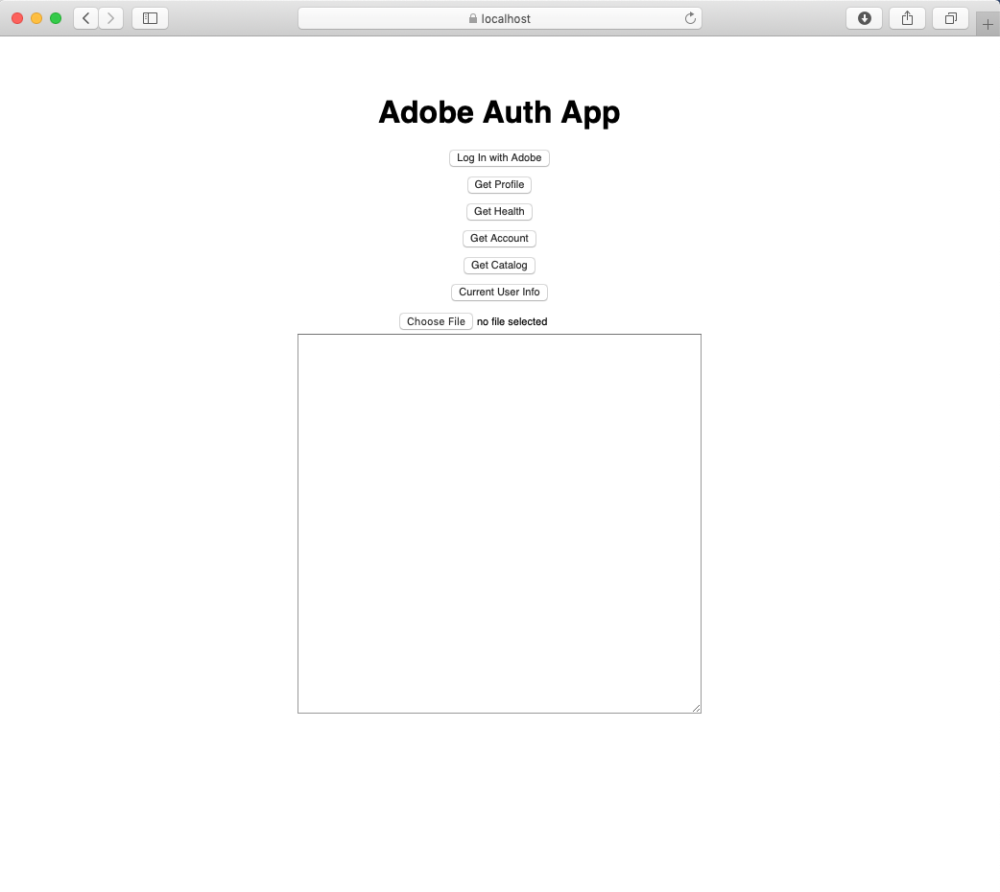

## Upload Image Example

This example demonstrates how to upload a single image to the catalog of an authenticated customer. It is based on the [Authentication Example](./authenticate.md) in this repository. Before proceeding, ensure that you are able to successfully build, run, and login Lightroom customers with that code.

### Overlay New Code

An overlay of sample code can be found in this repository in the [samples/adobe-auth-node](adobe_auth_node) subdirectory. Copy these three files into their respective directories in the working authentication example:

```
adobe-auth-node
|- server
|  |- lr.js
|  |- routes.js
|- views
|  |- index.jade
```

The additional routes for the sample are found in `routes.js`, and to integrate them into the example, it is necessary to add the line `app.use(require('./routes'))` to _server/index.js_ above the routes included in that file:

```
--- /AdobeDocs/.../server/index.js
+++ server/index.js
@@ -28,6 +28,7 @@
         maxAge: 6000000
     }
 }));
+app.use(require('./routes'))
 
 /* Routes */
 app.get('/', function (req, res) {
```

### Run the Example

When the new code has been copied over, and the rountes included in the server, run the sample with `npm start` and browse to the endpoint.

You should see a list of buttons that test the various Lightroom Services endpoints, and an input option to upload a file to the authenticated Lightroom customer catalog. It is necessary to login before accessing the account and catalog, or to upload images.



Clicking on the various buttons should generate output in the text area at the bottom of the page.
